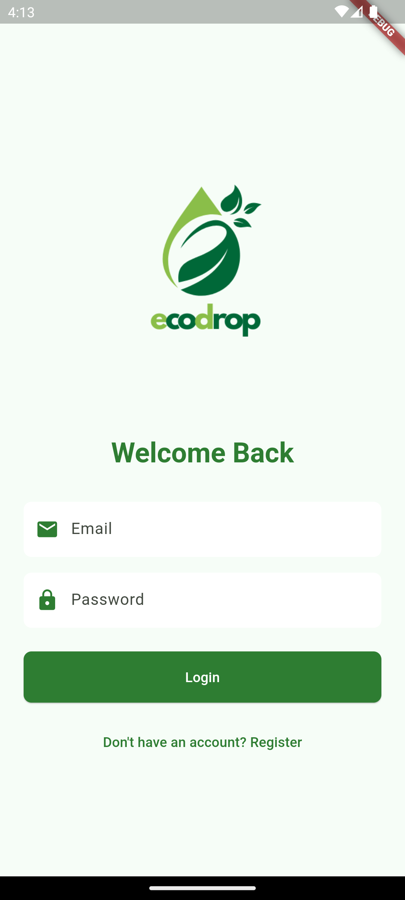
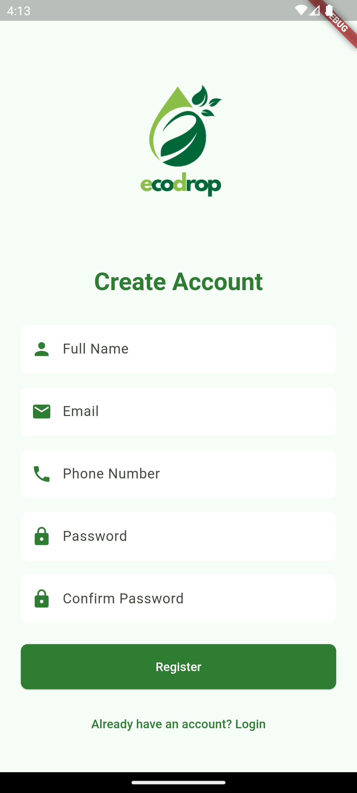
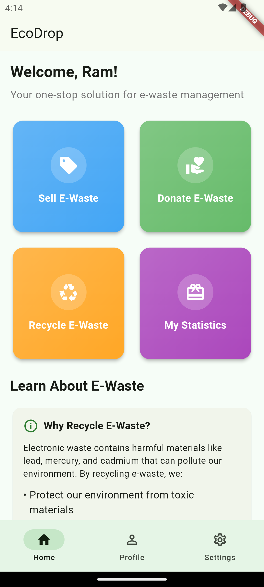
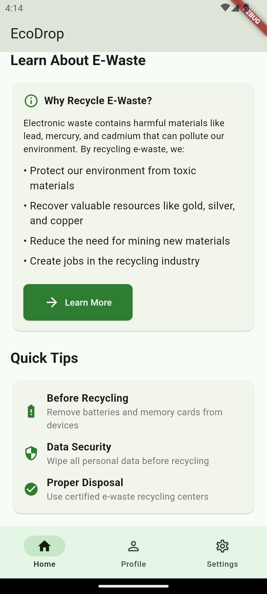
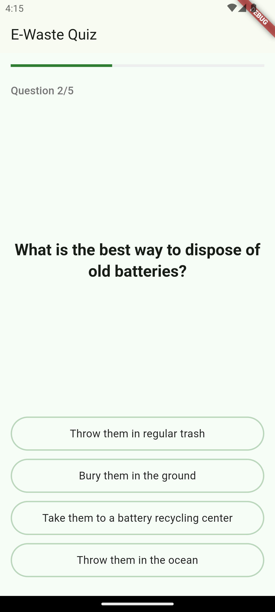
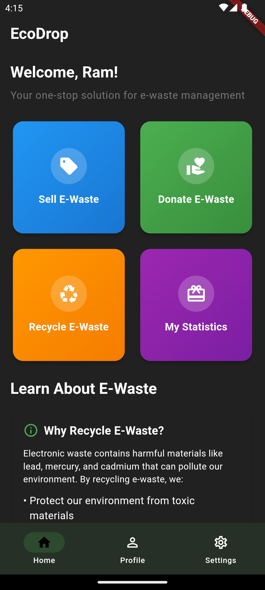
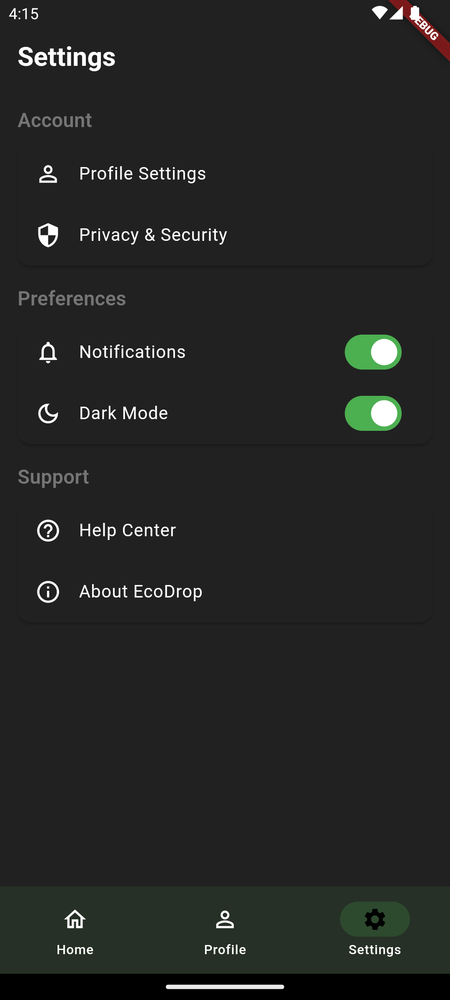
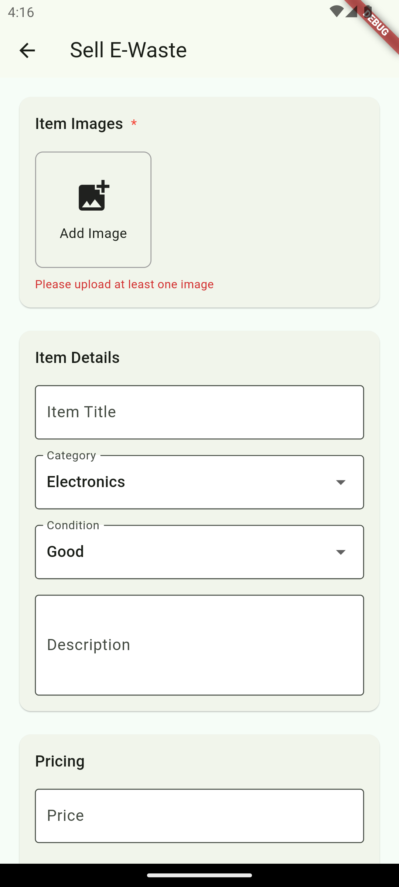
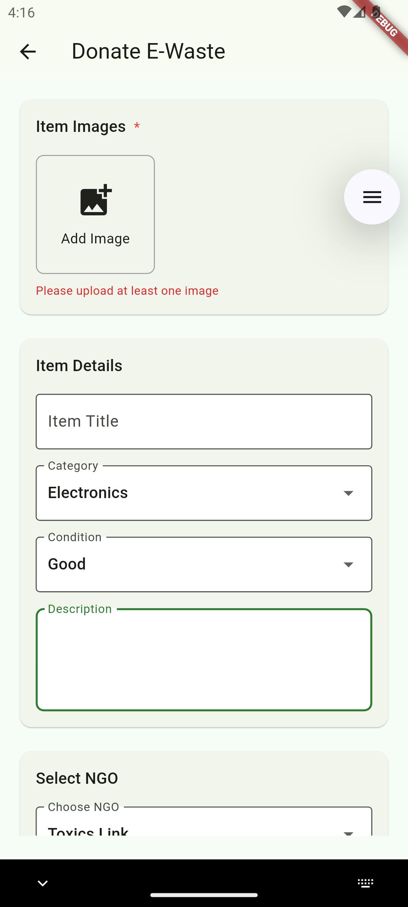
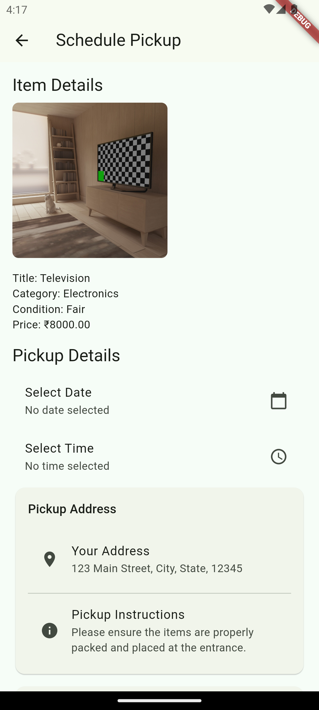

<div align="center">
  
  <h1>🌿 EcoDrop</h1>
  <p><i>Recycle. Donate. Sell. Reward.</i></p>
</div>

---

EcoDrop is a **cross-platform mobile app** built using **Flutter** that allows users to **recycle, donate, or sell waste items** on a single platform. It promotes environmental sustainability with an **eco-points incentive system** that rewards responsible disposal behavior.

---

## 📲 Features

- ♻️ Recycle, donate, or sell waste from one app.
- 🧾 Real-time waste listings with images and descriptions.
- 🚚 Pickup requests handled by collectors.
- 🪙 Eco-points awarded for successful pickups.
- 🔐 Secure login with Firebase Authentication.
- 🌗 Light/Dark mode support.

---

## 🔧 Tech Stack

| Technology         | Purpose                                      |
|--------------------|----------------------------------------------|
| **Flutter & Dart** | Cross-platform UI development                |
| **Firebase Auth**  | Secure user authentication                   |
| **Firestore**      | NoSQL real-time database                     |
| **Cloud Storage**  | Store images of waste listings               |
| **Cloud Functions**| Handle serverless logic (e.g., eco-points)   |

---

## 📸 Screenshots

> Replace with your app screenshots

<p float="left">
  
  
  
   
  
  
   
  
  
   
  
</p>

---

## 🚀 Getting Started

Follow the steps below to set up and run the EcoDrop project locally:

1. **Clone the repository:**

   ```bash
   git clone https://github.com/your-username/ecodrop.git
   cd ecodrop

2. **Install dependencies:**
   ```bash
   flutter pub get

3. **Connect Firebase:**

-> Add your google-services.json file to the android/app/ directory.

-> Add your GoogleService-Info.plist file to the ios/Runner/ directory.

-> Make sure Firebase services like Authentication, Firestore, Storage, and Cloud Functions are properly configured in the Firebase Console.

4. **Run the app:**
   ```bash
   flutter run

